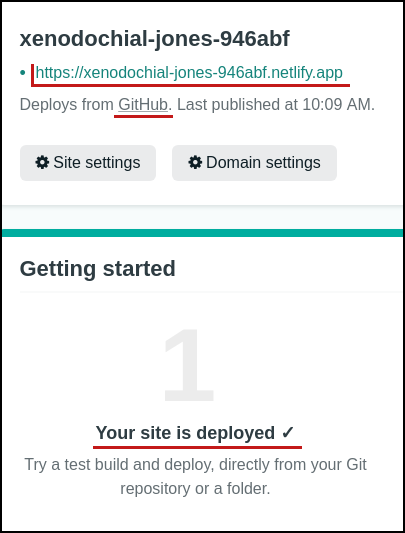

# Challenge Dojo Escape Game

Bienvenue sur le défi Escape Game organisé par Theodo. Le but de ce challenge consiste à réaliser ton propre escape game en web 😯 ! Tu trouveras sur cette page toutes les informations nécessaires pour le faire notamment les procédures d'installation du projet, comment le lancer en local sur ta machine et comment le déployer en production sur ton compte github 🥳 !

Afin de pouvoir réaliser ce défi sereinement, nous avons codé un exemple d'escape game tout simple dans ce repo. Réutiliser le code de l'exemple n'est pas obligatoire bien que ça pourrait s'avérer utile !

En ce qui concerne le thème et le type d'escape game, le choix est libre ! Nous avons juste défini une liste de critères et de fonctionnalités qui pourraient servir à convaincre notre jury de la qualité de ton escape game.

## Prérequis

Avant de commencer, tu as besoin de nodejs et npm, deux outils utilisés quasiment tout le temps à Theodo :

```bash
node --version
# v10+
```

```bash
npm --version
# 6+
```

[Si tu ne connais pas ces outils, tu peux suivre cette documentation NPM pour les installer sur ta machine](https://docs.npmjs.com/downloading-and-installing-node-js-and-npm)

## Installation

### Creation du repo

Pour te faciliter la vie ce repo est un template, il te suffit de cliquer sur le bouton **Deploy to netlify** pour créer un repo à partir de ce boilerplate:

<a href="https://app.netlify.com/start/deploy?repository=https://github.com/theodo/dojo-escape-game"></a>

Tu vas devoir te créer un compte avec netlify (les quotas gratuits pour développeurs sont très généreux), tu peux utiliser ton compte github comme single sign-on.

Une fois fait, tu auras un repo perso pour le projet et ton site sera déployé automatiquement sur netlify à chaque fois que tu push des changement sur la branche master.



Le lien de ton site s'affiche sur netlify. Ie: https://<NOM_RANDOM>.netlify.app.

Dernière chose à faire changer la visibilité de ton repo en privé dans les settings. C'est pour éviter que d'autres ne te volent ton code 😈 !

Tu peux maintenant cloner ton repo localement pour commencer à développer. Pour le trouver, il faut aller dans tes repos personnels Github puis trouver `dojo-escape-game`.

### Développer

Pour développer sur le projet, il reste à installer les outils qui vont transpiler les sources placées dans [src][./src] en un site web pour travailler localement.

pour installer les outils nodejs, il suffit de faire:

```bash
npm install
```

Une fois les dépendances installées, pour servir le site web localement sur [http://localhost:1234](http://localhost:1234), il suffit alors de lancer:

```bash
npm start
```

### Publier une version

Avec l'intégration netlify, il te suffit de pousser des changements sur la branche master de ton repo github pour déployer la nouvelle version.

## Structure

La page est un simple fichier HTML : `src/index.html`.

Le scénario de l'escape game est décrit dans `src/index.js`. Il utilise le moteur du jeu dans `src/Game/` et l'interface `src/Interface/` pour expliciter le comportement du jeu.

## Critères

### Requis

🚨 Les fonctionnalités suivantes sont attendues et obligatoires pour atteindre un jeu minimal. Une partie d'entre elles ont déjà été développées dans l'exemple fourni dans ce repo: 🚨

- Avoir une carte qui montre les possibilités de déplacement. Le joueur doit savoir dans quelle 'pièce' il est sur la carte.
- Inventaire pour le joueur.
- Objets dans la salle. Le joueur doit pouvoir récupérer les objets de la salle pour les avoir dans son inventaire.
- Mouvements validés par des conditions. Ces conditions peuvent porter sur n'importe quel élément du jeu comme par exemple: la pièce dans laquelle le joueur est actuellement ou son inventaire actuel.
- Personnalisation du nom du joueur. Un joueur doit pouvoir entrer son nom en début de jeu pour le voir apparaître au niveau du champ de texte.
- Le succès de l'escape game est défini et visualisé lors de la réussite

### Élements qui rapportent des points

Les fonctionnalités définies ci-dessous améliorent l'expérience de jeu 🎮 et ne sont pas obligatoires. Cependant, chaque fonctionnalité développée en plus sera très appréciée par nos joueurs 😎 !! (ETQJ = En tant que joueur 😀).

- ETQJ, je peux découvrir des salles seulement sous certaines conditions
- ETQJ, je veux pouvoir voir des éléments rappelant le thème de l'escape game dans le background ⛱️
- ETQJ, je veux voir les noms des salles directement sur la carte
- ETQJ, je veux pouvoir jouer que avec mon clavier avec des instructions qui expliquent le rôle de chaque touche
- ETQJ, je peux recommencer la partie à tout moment en cliquant sur un bouton
- ETQJ, lorsque je refresh la page, je veux retrouver mon état du jeu tel que je l'ai laissé

NB: Les fonctionnalités _ne sont pas_ triées par ordre de difficulté 😜

### Evaluation Finale

Pour remporter le grand prix de ce défi 🥇, les escape game seront d'abord évalués sur l'expérience de jeu et l'originalité du design et du scénario. La présence des fonctionnalités ci-dessus sera alors prise en compte. Enfin, les meilleurs escape game seront soumis au vote par un jury de Theodoers expérimentés.

### Ligne d'arrivée 🥅

Une fois terminé, tu peux nous envoyer ton jeu en mettant le lien Github de ton repo dans le channel Discord: #défi-accompli.